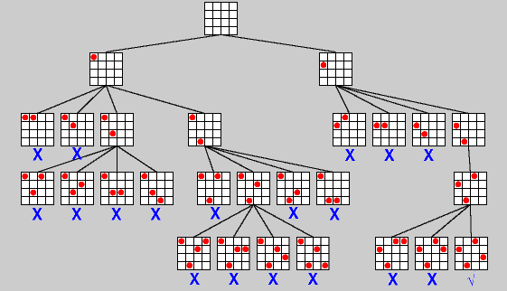

# python-sudoku-solver
A python application that solves any 9x9 sudoku game using backtracking algorithm

# What is a sudoku game?
The following information states how modern sudoku originated:

[[Ref][1]] On July 6, 1895, Le Siècle's rival, La France, refined the puzzle so that it was almost a modern Sudoku. It simplified the 9×9 magic square puzzle so that each row, column, and broken diagonals contained only the numbers 1–9, but did not mark the subsquares. Although they are unmarked, each 3×3 subsquare does indeed comprise the numbers 1–9 and the additional constraint on the broken diagonals leads to only one solution.

These weekly puzzles were a feature of French newspapers such as L'Echo de Paris for about a decade, but disappeared about the time of World War I.

You can find one example of a sudoku board at the image I shared below.

  

In order to test python-sudoku-solver, it may be a good test case with a solution

# What is a backtracking algorithm?
[[Ref][2]] Backtracking is an algorithmic-technique for solving problems recursively by trying to build a solution incrementally, one piece at a time, removing those solutions that fail to satisfy the constraints of the problem at any point of time (by time, here, is referred to the time elapsed till reaching any level of the search tree).

# How to solve sudoku game using backtracking algorithm?
This image shows how backtracking algorithm is working on a problem. In order to apply backtracking algorithm to sudoku game problem, You can use this image to iterate the procedure.

  

Idea behind backtracking algorithm is that

1. "Select a node(empty spce in our case)"
2. "Iterate"
   - "Assign a possiple solution"
   - "Check whether the solution is correct or not"
   - "If it is correct then choose that possible solution as correct and go further"
   - "If it is not correct and all possible solutions are failed then go back one step"

At the end of these steps, sudoku game must be solved if it was not created wrong :)

# Shortcut keys for sudoku game with pygame interface
| Shortcut Key  | Usage |
| ------------- | ------------- |
| SPACEBAR      | Show solution of the game  |
| C  		| Control all entries and make green if correct  |
| BACKSPACE  	| Reset the game |
| ENTER         | Show solution of the game iteratively|

[1]: https://en.wikipedia.org/wiki/Sudoku
[2]: https://www.geeksforgeeks.org/backtracking-algorithms/
